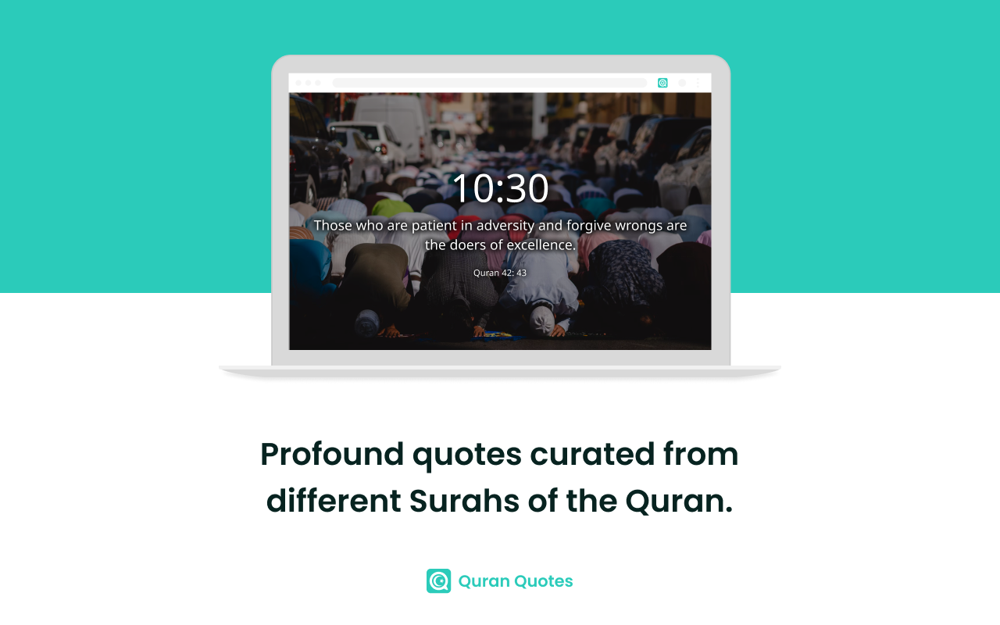

<!-- HEADER -->

  

  <h1 align="center">Quran Quotes - Chrome Extension</h1>

  

    Start each new tab with inspiration and wisdom from the sacred texts of the Quran.
     
     
    <a href="https://chromewebstore.google.com/detail/quran-quotes/mkodaphdaapdoefibodjjaphpecakeoj?hl=en&authuser=0"><strong>Chrome Web Store</strong></a>
    ·
    <a href="https://docs.google.com/document/d/1xlNkgS9AYuAnAPopLZ0wKIA4hlt79XNGSBslL4hh2hA/edit?usp=sharing"><strong>Project Spec</strong></a>
    ·
    <a href="https://www.figma.com/proto/CxOjL8qemNO054PlbJFyCE/Quote-Apps?type=design&node-id=89-99&t=0PvsBZOxjpKT84nM-1&scaling=scale-down&page-id=1%3A2&starting-point-node-id=89%3A99&mode=design"><strong>Figma Prototype</strong></a>
    ·
    <a href="https://docs.google.com/document/d/1E5xUH0P_CKSNENPM2F6S5BkT6mA9_BkPfQXoTUQfE5g/edit?usp=sharing"><strong>Privacy Policy</strong></a>
  

<!-- TABLE OF CONTENTS -->

  
Table of Contents

  <ol>
    <li>
      <a href="#about-the-project">About The Project</a>
    </li>
    <li>
      <a href="#how-to-set-up">How To Set Up</a>
      <ul>
        <li><a href="#user-setup">User Setup</a></li>
        <li><a href="#developer-setup">Developer Setup</a></li>
      </ul>
    </li>
    <li><a href="#technologies">Technologies</a></li>
    <li><a href="#contributing">Contributing</a></li>
    <li><a href="#acknowledgments">Acknowledgments</a></li>
  </ol>

<!-- ABOUT THE PROJECT -->

## About The Project

Elevate your browsing experience with Quran Quotes. Start each new tab with inspiration and wisdom from the sacred texts of the Quran. With this extension, every time you open a new tab, you'll be greeted by a thought-provoking quote from the Quran, handpicked to uplift your day and provide spiritual nourishment.

    
    
    

(<a href="#readme-top">back to top</a>)

<!-- HOW TO SET UP -->

## How To Set Up

### User Setup

Quran Quotes is published to the Chrome Web Store. To install it within your Chrome browser:

1. Navigate to the <a href="https://chromewebstore.google.com/detail/quran-quotes/mkodaphdaapdoefibodjjaphpecakeoj?hl=en&authuser=0">Quran Quotes listing</a>.
2. Click the <i>Add To Chrome</i> button.
3. After it is installed, simply open a new tab and it will be populated with the extension's content. 

### Developer Setup

1. Clone this repo to your local.
2. Navigate to <a href="chrome://extensions/">chrome://extensions/</a>.
3. Make sure <i>Developer mode</i> is toggled on in the top right of the webpage.
4. Click on the <i>Load unpacked</i> button in the top left of the webpage and select the <i>quran-quotes</i> folder.
3. After it is added, simply open a new tab and it will be populated with the extension's content. 

<!-- TECHNOLOGIES -->

## Technologies

Quran Quotes was built using the following technologies:

- 
- 
- 

(<a href="#readme-top">back to top</a>)

<!-- CONTRIBUTING -->

## Contributing

Contributions are what make the open source community such an amazing place to learn, inspire, and create. Any contributions you make are **greatly appreciated**.

If you have a suggestion that would make this better, please fork the repo and create a pull request. You can also simply open an issue with the tag "enhancement".
Don't forget to give the project a star! Thanks again!

1. Fork the Project
2. Create your Feature Branch (`git checkout -b feature/AmazingFeature`)
3. Commit your Changes (`git commit -m 'Add some AmazingFeature'`)
4. Push to the Branch (`git push origin feature/AmazingFeature`)
5. Open a Pull Request

(<a href="#readme-top">back to top</a>)

<!-- ACKNOWLEDGMENTS -->

## Acknowledgments

- [Google Fonts](https://fonts.google.com/)
- [othneildrew's Best README Template](https://github.com/othneildrew/Best-README-Template)
- [Ileriayo's Markdown Badges](https://github.com/Ileriayo/markdown-badges?tab=readme-ov-file)

(<a href="#readme-top">back to top</a>)

